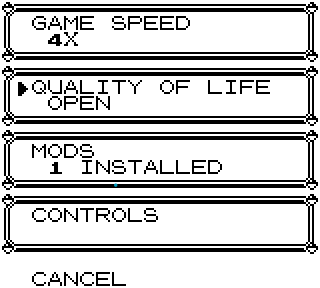
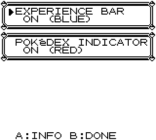
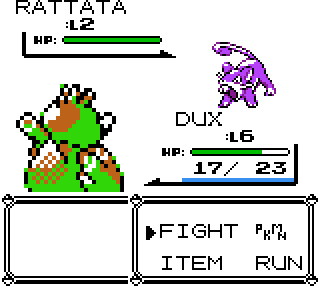
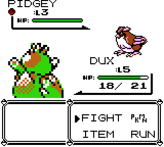
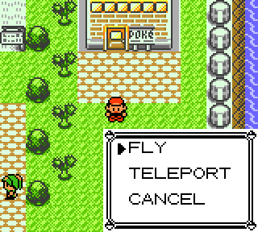
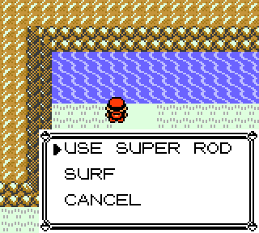
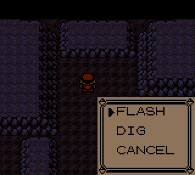

# Quality of Life additions from later generations

Adds optional, later generation style options.
Can be toggled individually.

## Installation

Download the newest release: https://github.com/unxpected-uxp/pokemon-gen1-recomp-mod-qol
and extract the `quality_of_life` folder into the game's `mods` directory.

### Portable mode

Place it beside the game:

`<game folder>/mods/quality_of_life/`

### Non-portable mode

- Windows: `%APPDATA%\pokemon-love2d\mods\quality_of_life\`
- macOS: `~/Library/Application Support/pokemon-love2d/mods/quality_of_life/`
- Linux: `~/.local/share/pokemon-love2d/mods/quality_of_life/`

## Usage

After extracting, restart the game. Features default to **OFF**. 
Configure the mod under **OPTION → QUALITY OF LIFE**
Settings are stored under this mod's namespace in `options.lua` and apply across save slots.

 

Experience bar during battle (Gen2 style):

Indicator for already caught Pokemon during wild encounters (Gen2 style):

Easy interactions:
When a Pokemon with CUT or STRENGTH is in the party, press [A] button when facing
bushes or boulders to activate automatically.
When facing water, pressing [A] automatically asks whether you want to FISH or SURF.
When FLY, DIG, FLASH or TELEPORT is available, pressing [SELECT] will let you do that directly.
Saves countless of button presses and navigating the menu

   